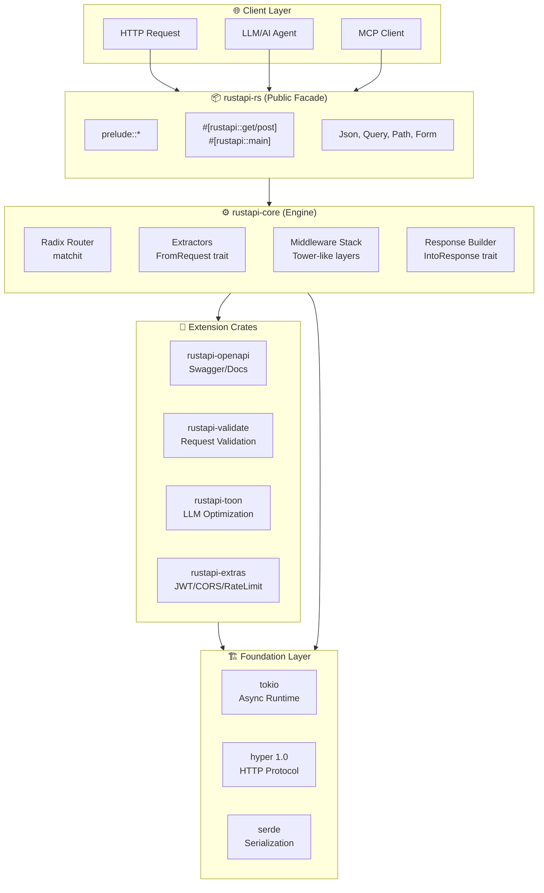
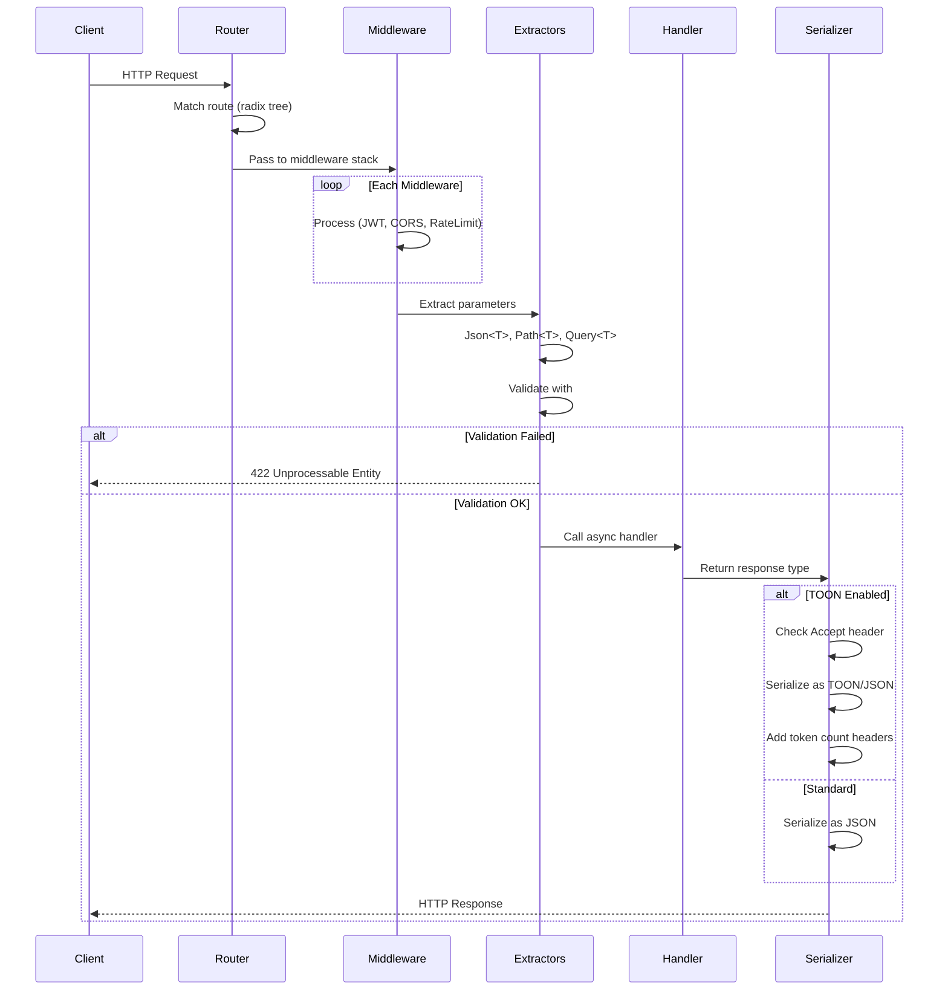
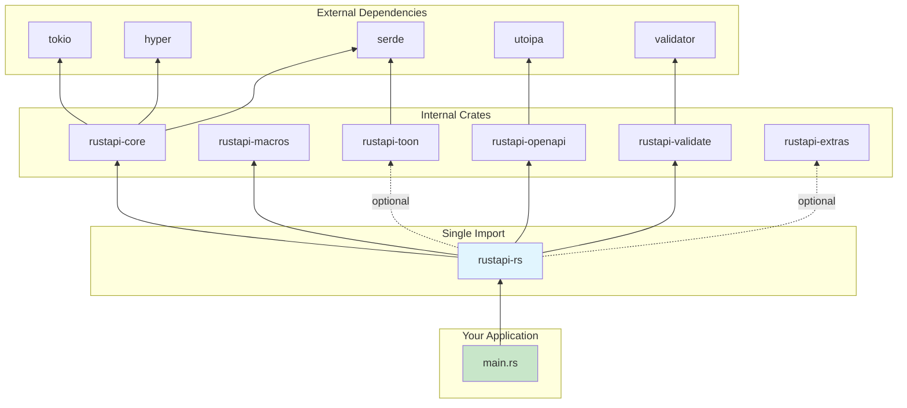

<div align="center">
  
  
  # RustAPI
  
  **The power of Rust. Modern DX. LLM-ready.**

  [](https://crates.io/crates/rustapi-rs)
  [](https://docs.rs/rustapi-rs)
  [](LICENSE)
  
  <a href="https://www.producthunt.com/products/rustapi?embed=true&utm_source=badge-featured&utm_medium=badge&utm_campaign=badge-rustapi" target="_blank"></a>
</div>

---

## Vision

RustAPI redefines **API development for the AI era**.

We combine Rust's performance and safety with FastAPI's ergonomics. Write type-safe, production-ready APIs without fighting trait bounds. **MCP servers**, **LLM integrations**, or classic REST APIs — one framework for all.

---

## Philosophy

> *"API surface is ours, engines can change."*

RustAPI follows a **Facade Architecture** — a stable, ergonomic public API that shields you from internal complexity and breaking changes.

### Core Principles

| Principle | What It Means |
|-----------|---------------|
| **🎯 5-Line APIs** | A working REST endpoint in 5 lines. No ceremony. |
| **🛡️ Stable Surface** | Your code depends on `rustapi-rs`. Internal crates (`hyper`, `tokio`, `validator`) are implementation details. |
| **🔄 Engines Change** | We can swap `hyper` for `h3`, upgrade `tokio`, or replace `validator` — your code stays the same. |
| **🎁 Batteries Included** | JWT, CORS, Rate Limiting, OpenAPI — all built-in, all optional via feature flags. |
| **🤖 LLM-First** | TOON format, token counting headers, MCP-ready. Built for the AI era. |

### Why This Matters

```
┌─────────────────────────────────────────────────────────────┐
│                    Your Application                          │
│                   use rustapi_rs::prelude::*                 │
├─────────────────────────────────────────────────────────────┤
│                     rustapi-rs (Facade)                      │
│              Stable API ── Never Breaks                      │
├───────────────┬───────────────┬───────────────┬─────────────┤
│ rustapi-core  │ rustapi-toon  │ rustapi-extras│ ...         │
│   (hyper)     │   (serde)     │    (jwt)      │             │
├───────────────┴───────────────┴───────────────┴─────────────┤
│              Foundation: tokio, serde, hyper                 │
│              ↑ Can be upgraded/swapped internally            │
└─────────────────────────────────────────────────────────────┘
```

**Internal upgrades don't break your code.** When `hyper 2.0` releases, we update `rustapi-core`. Your `RustApi::new()` keeps working.

📚 Read more: [docs/PHILOSOPHY.md](docs/PHILOSOPHY.md) | [docs/ARCHITECTURE.md](docs/ARCHITECTURE.md)

```rust
use rustapi_rs::prelude::*;

#[rustapi_rs::get("/hello/{name}")]
async fn hello(Path(name): Path<String>) -> Json<Message> {
    Json(Message { greeting: format!("Hello, {name}!") })
}

#[tokio::main]
async fn main() -> Result<(), Box<dyn std::error::Error + Send + Sync>> {
    RustApi::auto().run("0.0.0.0:8080").await
}
```

5 lines of code. Auto-generated OpenAPI docs. Production-ready.

---

## Quick Start

```toml
[dependencies]
rustapi-rs = "0.1.4"
```

```rust
use rustapi_rs::prelude::*;

#[derive(Serialize, Schema)]
struct User { id: u64, name: String }

#[rustapi_rs::get("/users/{id}")]
async fn get_user(Path(id): Path<u64>) -> Json<User> {
    Json(User { id, name: "Tunahan".into() })
}

#[tokio::main]
async fn main() -> Result<(), Box<dyn std::error::Error + Send + Sync>> {
    // Zero config: all `#[rustapi_rs::get/post/..]` routes are auto-registered.
    // Swagger UI is enabled at /docs by default (when built with the `swagger-ui` feature).
    RustApi::auto().run("127.0.0.1:8080").await
}
```

`http://localhost:8080/docs` → Swagger UI ready.

---

## Features

| Feature | Description |
|---------|-------------|
| **Type-Safe Extractors** | `Json<T>`, `Query<T>`, `Path<T>` — compile-time guarantees |
| **Zero-Config Routing** | Macro-decorated routes auto-register at startup (`RustApi::auto()`) |
| **Auto OpenAPI** | Your code = your docs. `/docs` endpoint out of the box |
| **Validation** | `#[validate(email)]` → automatic 422 responses |
| **JWT Auth** | One-line auth with `AuthUser<T>` extractor |
| **CORS & Rate Limit** | Production-ready middleware |
| **TOON Format** | **50-58% token savings** for LLMs |

### Optional Features

```toml
rustapi-rs = { version = "0.1.4", features = ["jwt", "cors", "toon"] }
```

- `jwt` — JWT authentication
- `cors` — CORS middleware  
- `rate-limit` — IP-based rate limiting
- `toon` — LLM-optimized responses
- `full` — Everything included

---

## Examples

All examples in this repository are written in the Phase 6 “zero-config” style.

```bash
cargo run -p hello-world
cargo run -p crud-api
cargo run -p auth-api
cargo run -p sqlx-crud
cargo run -p toon-api
cargo run -p proof-of-concept
```

---

## 🤖 LLM-Optimized: TOON Format

RustAPI is built for **AI-powered APIs**.

**TOON** (Token-Oriented Object Notation) uses **50-58% fewer tokens** than JSON. Ideal for MCP servers, AI agents, and LLM integrations.

```rust
use rustapi_rs::toon::{Toon, LlmResponse, AcceptHeader};

// Direct TOON response
#[rustapi::get("/ai/users")]
async fn ai_users() -> Toon<UsersResponse> {
    Toon(get_users())
}

// Content negotiation: JSON or TOON based on Accept header
#[rustapi::get("/users")]
async fn users(accept: AcceptHeader) -> LlmResponse<UsersResponse> {
    LlmResponse::new(get_users(), accept.preferred)
}
// Headers: X-Token-Count-JSON, X-Token-Count-TOON, X-Token-Savings
```

**Why TOON?**
- Compatible with Claude, GPT-4, Gemini — all major LLMs
- Cut your token costs in half
- Optimized for MCP (Model Context Protocol) servers

---

## Architecture

RustAPI follows a **Facade Architecture** — a stable public API that shields you from internal changes.

### System Overview



### Request Flow



### Crate Dependency Graph



### Design Principles

| Principle | Implementation |
|-----------|----------------|
| **Single Entry Point** | `use rustapi_rs::prelude::*` imports everything you need |
| **Zero Boilerplate** | Macros generate routing, OpenAPI specs, and validation |
| **Compile-Time Safety** | Generic extractors catch type errors at compile time |
| **Opt-in Complexity** | Features like JWT, TOON are behind feature flags |
| **Engine Abstraction** | Internal hyper/tokio upgrades don't break your code |

### Crate Responsibilities

| Crate | Role |
|-------|------|
| `rustapi-rs` | Public facade — single `use` for everything |
| `rustapi-core` | HTTP engine, routing, extractors, response handling |
| `rustapi-macros` | Procedural macros: `#[rustapi::get]`, `#[rustapi::main]` |
| `rustapi-openapi` | Swagger UI generation, OpenAPI 3.0 spec |
| `rustapi-validate` | Request body/query validation via `#[validate]` |
| `rustapi-toon` | TOON format serializer, content negotiation, LLM headers |
| `rustapi-extras` | JWT auth, CORS, rate limiting middleware |

---

## Roadmap

- [x] Core framework (routing, extractors, server)
- [x] OpenAPI & Validation
- [x] JWT, CORS, Rate Limiting
- [x] TOON format & LLM optimization
- [ ] *Coming soon...*

---

## License

MIT or Apache-2.0, at your option.
