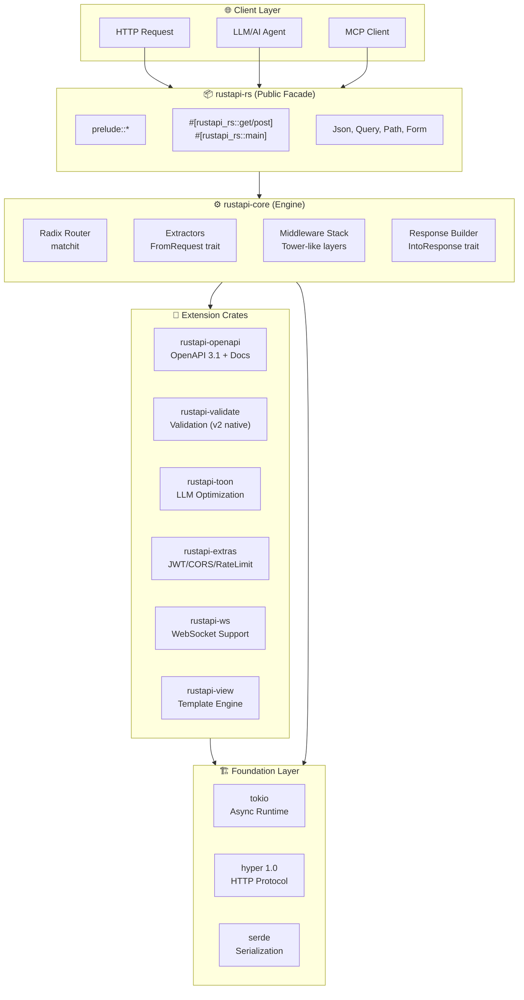
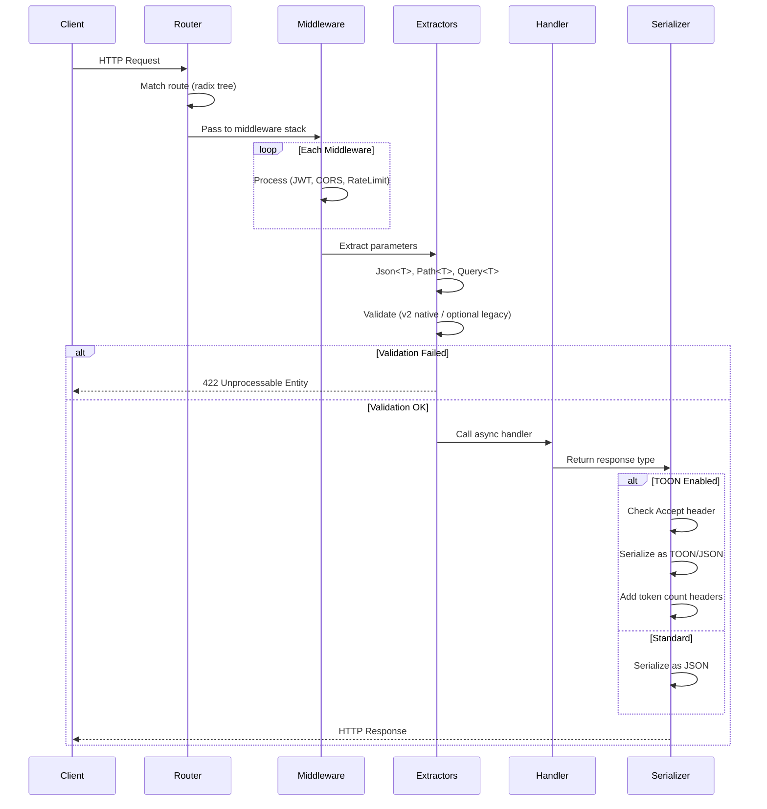
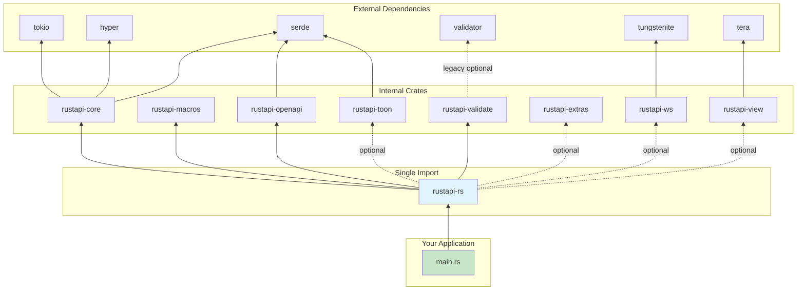

# System Architecture

RustAPI follows a **Facade Architecture** — a stable public API that shields you from internal complexity and breaking changes.

## System Overview

## Request Flow

## Crate Dependency Graph

## Design Principles

| Principle | Implementation |
|-----------|----------------|
| **Single Entry Point** | `use rustapi_rs::prelude::*` imports everything you need |
| **Zero Boilerplate** | Macros generate routing, OpenAPI specs, and validation |
| **Compile-Time Safety** | Generic extractors catch type errors at compile time |
| **Opt-in Complexity** | Features like JWT, TOON are behind feature flags |
| **Engine Abstraction** | Internal hyper/tokio upgrades don't break your code |

## Crate Responsibilities

| Crate | Role |
|-------|------|
| `rustapi-rs` | Public facade — single `use` for everything |
| `rustapi-core` | HTTP engine, routing, extractors, response handling |
| `rustapi-macros` | Procedural macros: `#[rustapi_rs::get]`, `#[rustapi_rs::main]` |
| `rustapi-openapi` | Native OpenAPI 3.1 model, schema registry, and docs endpoints |
| `rustapi-validate` | Validation runtime (v2 native default, legacy validator optional) |
| `rustapi-toon` | TOON format serializer, content negotiation, LLM headers |
| `rustapi-extras` | JWT auth, CORS, rate limiting, audit logging |
| `rustapi-ws` | WebSocket support with broadcast channels |
| `rustapi-view` | Template engine (Tera) for server-side rendering |
| `rustapi-jobs` | Background job processing (Redis/Postgres) |
| `rustapi-testing` | Test utilities, matchers, expectations |
