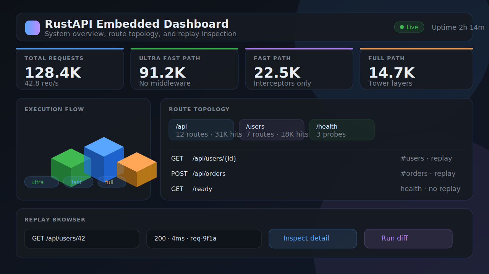

# Embedded dashboard

Use the embedded dashboard when you want a local, opt-in control plane for route topology, execution-path counters, request-stage telemetry, health endpoint discovery, and replay inspection.

> **Security notice**
> Keep the dashboard disabled by default in production-like environments unless it is protected by an admin token and your normal ingress/auth policy.



## Prerequisites

Enable the canonical dashboard feature on the public facade:

```toml
[dependencies]
rustapi-rs = { version = "0.1.335", features = ["core-dashboard"] }
```

If you also want the replay browser panel to load recorded traffic, enable replay too:

```toml
[dependencies]
rustapi-rs = { version = "0.1.335", features = ["core-dashboard", "extras-replay"] }
```

## Usage

```rust,ignore
use rustapi_rs::prelude::*;

#[rustapi_rs::get("/api/users")]
#[tag("users")]
#[summary("List users")]
#[description("Returns the current user collection.")]
async fn list_users() -> Json<Vec<&'static str>> {
    Json(vec!["Alice", "Bob"])
}

#[rustapi_rs::main]
async fn main() -> std::result::Result<(), Box<dyn std::error::Error + Send + Sync>> {
    RustApi::auto()
        .health_endpoints()
        .dashboard(
            DashboardConfig::new()
                .admin_token("local-dashboard-token")
                .path("/__rustapi/dashboard"),
        )
        .run("127.0.0.1:8080")
        .await
}
```

Open `http://127.0.0.1:8080/__rustapi/dashboard` and enter the token in the header field. The HTML shell is served without bearer headers so that browsers can load it, but JSON dashboard endpoints require the token when configured.

## Configuration

`DashboardConfig` supports:

- `.admin_token("...")` — protects `/api/*` dashboard JSON endpoints with `Authorization: Bearer <token>`.
- `.path("/__rustapi/dashboard")` — changes where the dashboard is mounted.
- `.title("...")` — labels the page for custom deployments.
- `.replay_api_path("/__rustapi/replays")` — points the replay browser at the replay admin API path.

The dashboard snapshot includes:

- execution path counters: **Ultra Fast**, **Fast**, and **Full**
- request-stage counters: received, routed, completed, failed
- route inventory: path, methods, OpenAPI tags, feature gates, health/replay eligibility
- route graph groups for topology filtering
- health endpoint summary
- replay admin API discovery metadata

## Replay browser

The dashboard does not create a new replay storage path. It reuses the existing replay admin API exposed by `ReplayLayer`.

```rust,ignore
use rustapi_rs::extras::replay::{InMemoryReplayStore, ReplayConfig, ReplayLayer};
use rustapi_rs::prelude::*;

let replay = ReplayLayer::new(
    ReplayConfig::new()
        .enabled(true)
        .admin_token("local-replay-token")
        .admin_route_prefix("/__rustapi/replays"),
)
.with_store(InMemoryReplayStore::new(200));

let app = RustApi::auto()
    .layer(replay)
    .dashboard(
        DashboardConfig::new()
            .admin_token("local-dashboard-token")
            .replay_api_path("/__rustapi/replays"),
    );
```

Use the replay panel to:

1. list recent recordings with method/path filters
2. inspect request and response details
3. run a diff against a target URL

The replay token can be different from the dashboard token. If the replay token field is empty, the dashboard token is reused.

## State rewind model

The dashboard intentionally ships an **inspection-first** time-travel workflow:

- captured requests and responses are browsed through `ReplayLayer`
- selected requests can be replayed against a local/staging target
- diffs show response-level behavior changes

Generic application state rewind is not enabled implicitly. RustAPI cannot safely roll back arbitrary databases, queues, caches, external calls, or in-memory state without an application-specific contract. If an app needs true state rewind later, it should add explicit opt-in snapshot hooks around its own state boundaries and keep those hooks separate from the default dashboard surface.

For this dashboard version, full state rollback is therefore **not required**; replay inspection and diffing are the supported baseline.

## Disabled-feature performance budget

The dashboard feature is opt-in through `core-dashboard`. Builds that do not enable that feature compile out the dashboard module, route mounting, and request-stage instrumentation.

The budget for dashboard-disabled builds is:

- no dashboard routes are registered
- no `DashboardMetrics` state is inserted
- no dashboard-specific atomics are touched on the request path
- the ultra-fast, fast, and full execution tiers stay unchanged

Any future dashboard work that touches `server.rs`, `router.rs`, or the execution-path dispatch should rerun the perf snapshot:

```powershell
cargo run -p rustapi-core --example perf_snapshot
```

See [Performance Benchmarks](../../../PERFORMANCE_BENCHMARKS.md) for the canonical benchmark policy.

## Verification

After enabling the dashboard:

1. start the app
2. visit `/__rustapi/dashboard`
3. enter the dashboard token
4. hit one or more application routes
5. confirm counters, route groups, and request-stage values update
6. if replay is enabled, load the replay panel and inspect a captured entry
7. disable `core-dashboard` in a normal build and confirm the dashboard route is not mounted

## See also

- [Time-Travel Debugging (Replay)](replay.md)
- [Observability](observability.md)
- [Production Tuning](high_performance.md)
